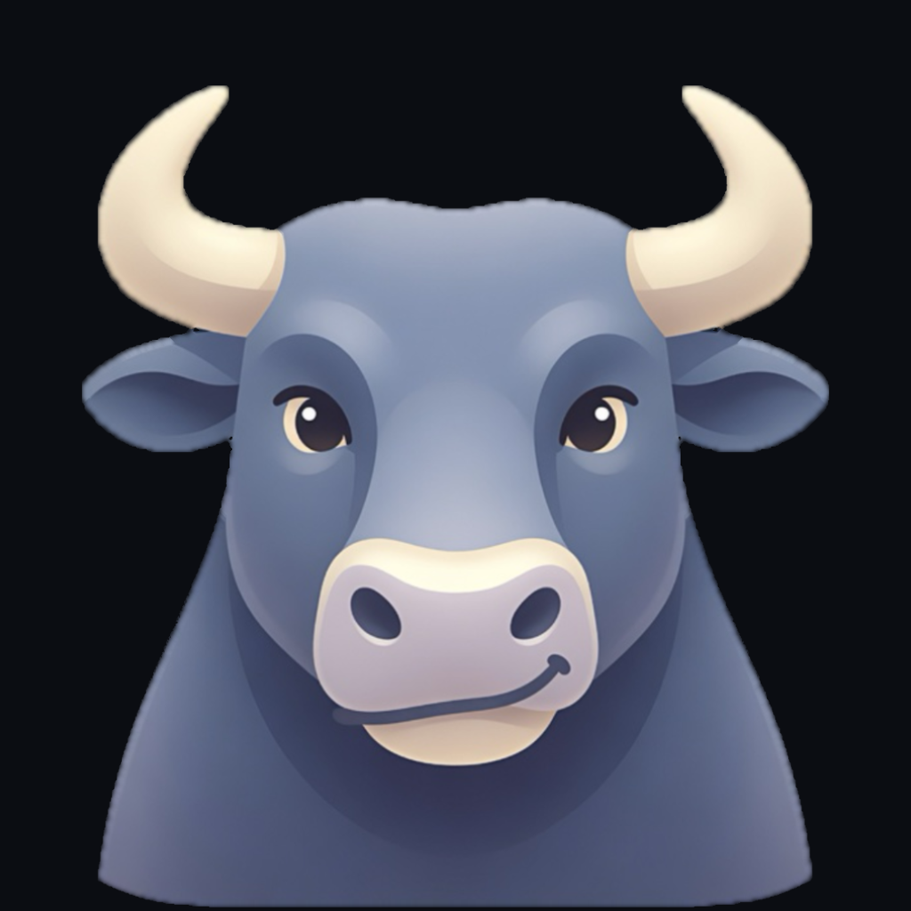
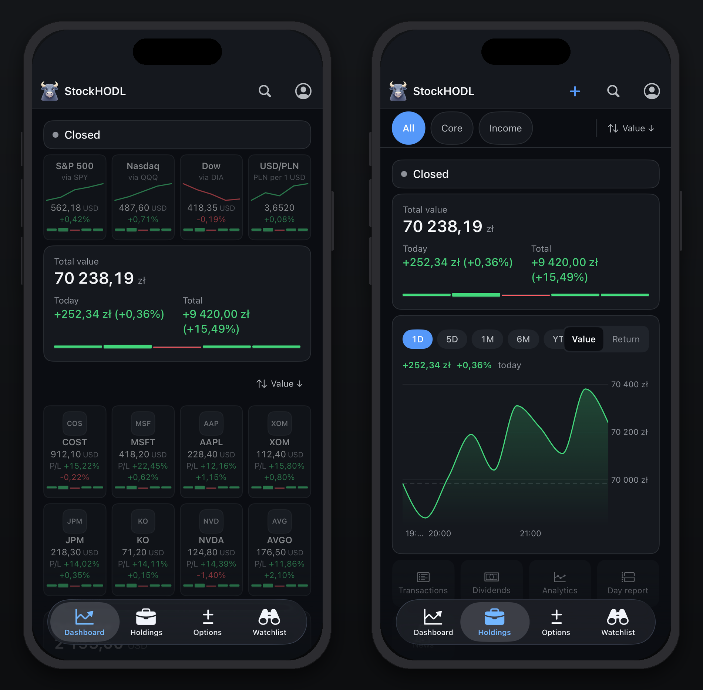
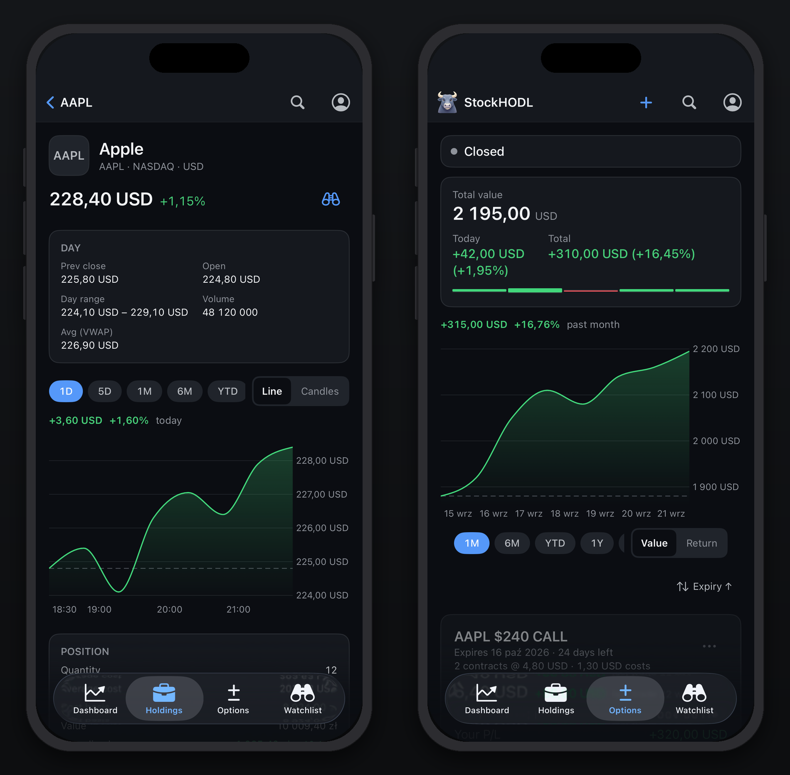
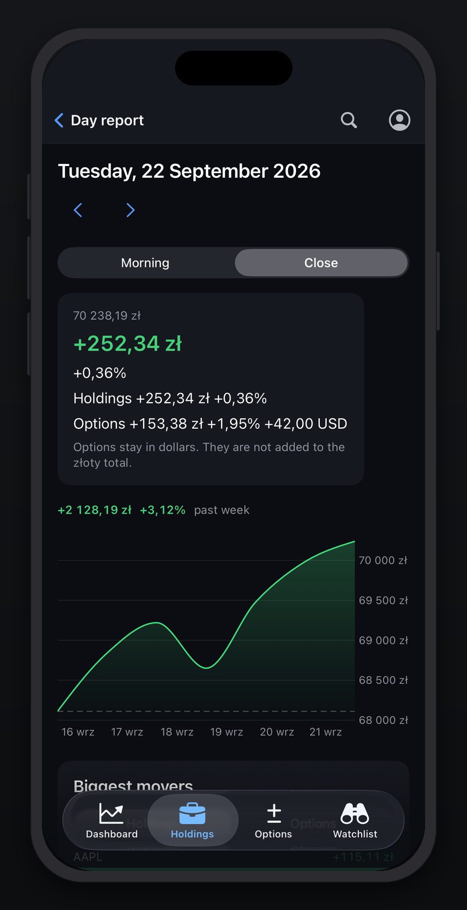
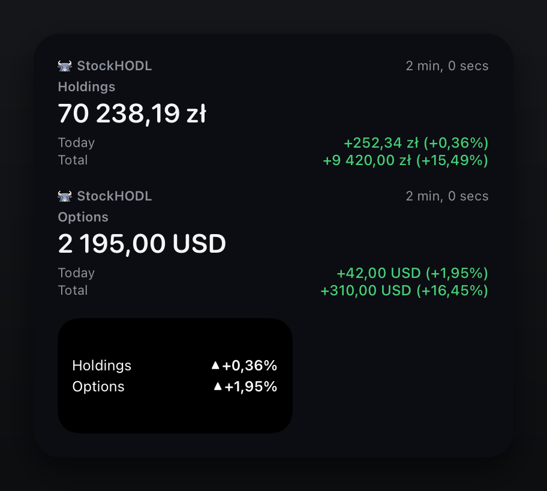

<p align="center">
  
</p>

<h1 align="center">StockHODL</h1>

<p align="center">

   

</p>

**Your US-stock portfolio, on your phone, with exact money.** StockHODL is an
iPhone app with Home Screen widgets over a small server you host yourself:
you enter your trades, it tells you what they are worth now, what they did
today and what they have done since you bought them, in złoty and in dollars,
to the grosz.



## Why StockHODL

**A tracker you can trust to the last digit.** Broker apps show one account
each, and spreadsheet trackers round. This one keeps every lot you enter,
across as many portfolios and brokers as you like, and never lets a float near
the money.

- **Exact decimal money, end to end.** Prices, quantities, fees and FX rates
  travel as decimal strings from the database to the screen; there is no
  floating-point arithmetic on an amount anywhere, on the server or the phone.
- **Market data goes through your server.** Quotes, charts and news come from
  Massive (15-minute delayed on the Starter tier) and FX from the Polish
  central bank, all fetched server-side; the phone never talks to a vendor, so
  your key never leaves the server.
- **One user, passkey-only.** No password, no sign-up form, no second account.
  Exactly one email address can ever hold an account.
- **A day report, twice a day.** A morning brief before the open and a close
  summary after it: your figures for the day and a short written account of
  what moved and why.
- **Widgets.** Holdings and Options tiles on the Home Screen and a Lock Screen
  accessory, with the day's line drawn in.

## Quick start

You need a Mac with Xcode 26, Node 24 with pnpm 11, and free accounts at Neon,
Vercel and Massive. The full walk-through, including every secret and every
place your own identifiers go, is [docs/setup.md](docs/setup.md).

1. **Clone and install.**

   ```bash
   git clone https://github.com/<you>/stockhodl.git && cd stockhodl
   pnpm install
   ```

   **You'll see:** `node_modules/` filled in and `Done` from pnpm.

2. **Create the database and migrate.** Create a Neon project, copy its pooled
   connection string into `DATABASE_URL` in `.env` (step 3), then run
   `pnpm db:migrate`. **You'll see:** the migrations under `drizzle/` applied,
   and the tables in Neon's console.

3. **Fill in `.env`.** `cp .env.example .env`, then set the required keys:
   `DATABASE_URL`, `BETTER_AUTH_SECRET` (`openssl rand -base64 48`),
   `BETTER_AUTH_URL` (`http://localhost:3000` for now), `ALLOWED_EMAIL` (your
   address, the only one that can ever sign in) and `STOCK_API`. Optional:
   `CRON_SECRET` for the scheduled jobs, `ANTHROPIC_API_KEY` for screenshot
   import and the day report's prose, `APPLE_APP_ID` for passkeys on a real
   phone, and the five `APNS_*` keys for push. **You'll see:** `pnpm build`
   finish without an "Invalid server environment" error.

4. **Get a Massive key.** Sign up at massive.com and take the Starter tier;
   put the key in `STOCK_API` and run `pnpm probe:massive`. Indices are not
   entitled on that tier, so the market strip shows SPY, QQQ and DIA in their
   place. **You'll see:** five checks and `All probes succeeded.`

5. **Sign in the first time.** There is no sign-up form. Run
   `pnpm recover '<a long throwaway password>'`, set
   `RECOVERY_MODE=1`, run `pnpm dev`, open the app on the simulator and use
   **Emergency password**, then **Settings → Passkeys → Add a passkey**. Set
   `RECOVERY_MODE=0` again. **You'll see:** the Dashboard, and your passkey
   listed under Settings → Passkeys.

6. **Deploy.** Import the repository into Vercel with the same environment
   variables, add the GitHub secrets listed in [docs/setup.md](docs/setup.md)
   §6, and push to `main` — the push is the deploy. **You'll see:** `CI` and
   `Deploy` green in `gh run list --limit 4`, and an empty 404 at your domain's
   root (there is no website, by design).

7. **Make the iPhone app yours.** Put your Apple team, bundle id, App Group,
   keychain group and domain in the places [docs/setup.md](docs/setup.md) §8
   lists, then set `APPLE_APP_ID` on the server. **You'll see:** the app build
   and sign in with your passkey on a real phone.

8. **TestFlight.** Add the three App Store Connect secrets (`ASC_KEY_ID`,
   `ASC_ISSUER_ID`, `ASC_PRIVATE_KEY`) and the two signing ones
   (`IOS_DIST_P12`, `IOS_DIST_P12_PASSWORD`), then push a change under `ios/`.
   **You'll see:** a new build in TestFlight a few minutes after the
   `TestFlight` workflow goes green.

## A day with StockHODL

1. **Before the open**, the morning brief arrives as a push: yesterday's move
   and one line on what to watch today. Tap it and the day report opens on
   that morning.
2. **The Dashboard** shows your total value with its five-day lights, the
   market strip (SPY, QQQ, DIA and USD/PLN), and a tile per holding and
   option.
3. **Holdings** narrows to one portfolio or shows them all, sorted the way
   you last left it, with the value or return chart above.
4. **An instrument** has its own chart with your trades marked on the line,
   your position, the day's stats, news and dividends.
5. **You bought something.** Photograph the broker's confirmation screen and
   the trade form fills itself in, with a note saying what it had to convert
   or assume.
6. **After the close**, the close summary push gives the day's figure for the
   whole book.
7. **The day report** has the numbers, the movers, the events coming up and a
   written account of the session; every report the app has written is listed
   at the bottom of the Dashboard.

## Dashboard and market strip

Total value and the options value, each with the day's change and five-day
lights, above a strip of four tiles: SPY, QQQ and DIA standing in for the
indices, and USD/PLN. Every tile opens a screen of its own with a chart.

## Holdings and options

Holdings aggregate your lots per ticker at average cost, per portfolio or
across all of them, in złoty. Options are tracked per lot in dollars and kept
apart from the stock book on purpose; adding one walks the real chain
(underlying, expiry, call or put, strike), so you can only add a contract that
exists.



## Transactions and screenshot import

Every trade is entered once and edited in place; the server validates
everything the phone does. Screenshot import reads a broker confirmation (the
mBank and Saxo layouts are the tested ones) through Anthropic's API and fills
the form, never the database: you check it and press Save.

## Analytics

Returns over time against SPY, allocation by sector and by ticker,
concentration, and drift from the target weights you set per portfolio.

## Watchlist and search

Search any US ticker, open it without owning it, and watch it in one tap.
Watched stocks stream on their own and never widen the holdings feed.

## News

Per-ticker headlines from Massive, with images and publisher logos proxied
through your server so the phone makes no request to a publisher.

## Day report

Written twice a weekday by two scheduled jobs: a morning brief before the open
and a close summary after it. The figures are computed from your own book; the
prose is written by Anthropic's API with web search, stored once and never
regenerated.



## Push

Price alerts on large moves, the morning brief and the close summary, each
behind its own switch in Settings. Every push opens the exact screen it is
about.

## Widgets

A Holdings tile in złoty, an Options tile in dollars and a Lock Screen
accessory with both. They refresh on the market's schedule — every fifteen
minutes while a session runs, rarely when it does not — and never show money
beside a signed-out session.



## FX

Every non-złoty trade carries its USD/PLN rate: the NBP Table A mid rate from
the last business day before the trade date, the D-1 rule of Polish tax law.
It fills itself in and stays editable.

## Safety in brief

- There is no website: apart from Next's own build assets under `/_next/`,
  every path outside the JSON API answers 404 — an empty one without a
  session, a blank page with one.
- Passkey-only sign-in, one allowlisted email, two independent gates.
- The phone never contacts a market-data vendor; keys live only on the server.
- Scheduled jobs refuse any caller without the shared `CRON_SECRET`.
- Recovery is a local command-line tool, not a web page.
- A strict Content-Security-Policy and the usual security headers on every
  response.

What each part answers, sends and stores is in [SECURITY.md](SECURITY.md).

## Troubleshooting

**The build fails on a missing `STOCK_API`.** The server settings are checked
when the app is built, and the Massive key is required. Add it to `.env`
locally and to the Vercel project's environment variables.

**The passkey says "not found" after changing the domain.** A passkey belongs
to the domain it was made for, and `BETTER_AUTH_URL` is that domain. After a
move, sign in with the recovery tool and add a new passkey for the new domain.

**`vercel --prod` fails.** That is by design here: deploys go through the
`Deploy` workflow on a push to `main`. Push instead.

**TestFlight asks you to choose a certificate to revoke.** Apple caps
development certificates per account. Revoke an old one at
developer.apple.com, and keep `IOS_DIST_P12` holding both your Development and
Distribution certificates so the workflow never mints another.

## Everything else

- [docs/context.md](docs/context.md) — the architecture, every decision and
  why.
- [docs/ios-native.md](docs/ios-native.md) — the iPhone app's architecture.
- [docs/setup.md](docs/setup.md) — from clone to signed in, and making it
  yours.
- [docs/publishing.md](docs/publishing.md) — how this public copy is made.

## Contributing

See [CONTRIBUTING.md](CONTRIBUTING.md).

## Why I built it

Every broker I use shows its own slice, and none of them in złoty the way the
tax office counts it. This is the side-project answer: one place for all of it,
on the phone, with the numbers right. It is vibe coded, by someone with limited
programming experience, and very much a work in progress. It works for me and
it might work for you; or just steal the ideas.

## Credits

Built with [Claude Code](https://claude.com/claude-code), orchestrated with
[Dark Army](https://github.com/androszr/dark-army). Market data by
[Massive](https://massive.com), exchange rates by
[Narodowy Bank Polski](https://nbp.pl), and the day report's prose and
screenshot reading by Anthropic's API.


The mascots are the bull, who marks the brand, and the bear, who keeps empty
screens company. Copyright (c) 2026 Robert Androsz, as [LICENSE](LICENSE)
states.

## License

MIT; see [LICENSE](LICENSE).
